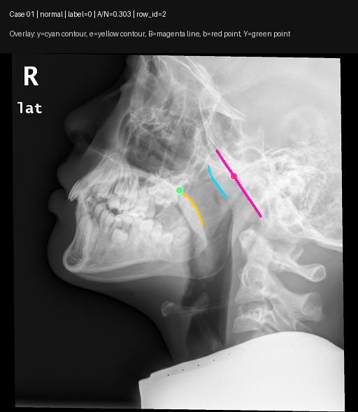
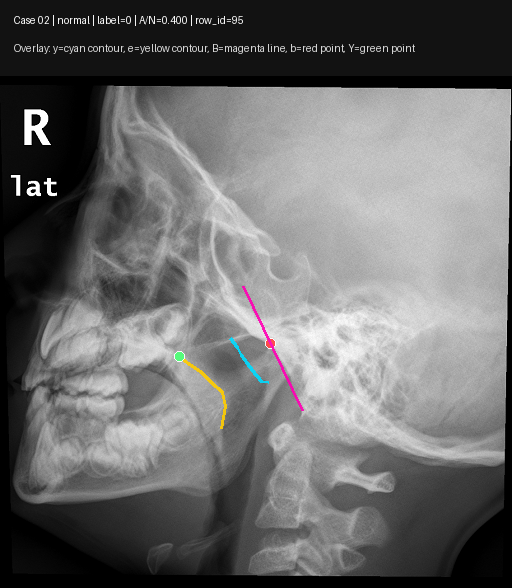
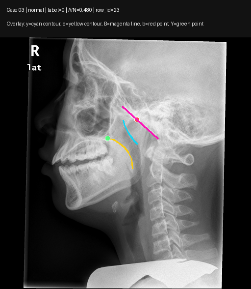
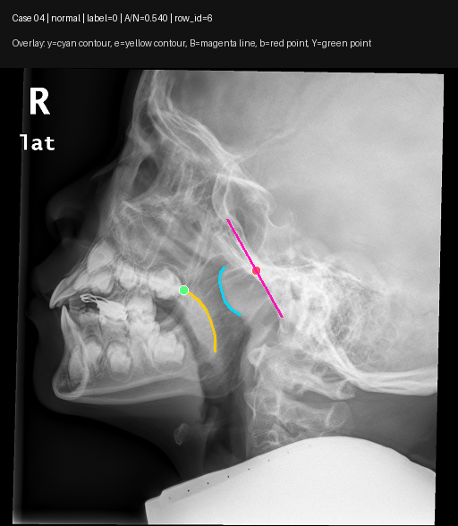
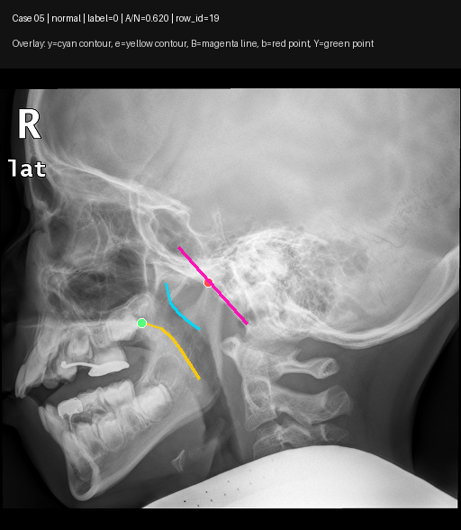
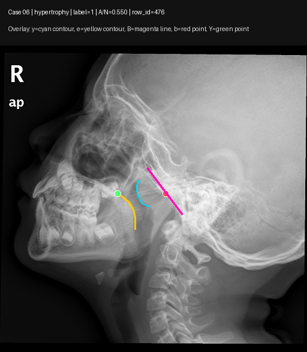
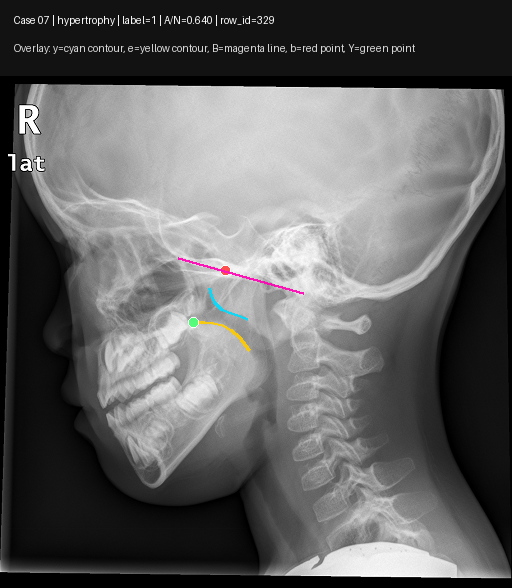
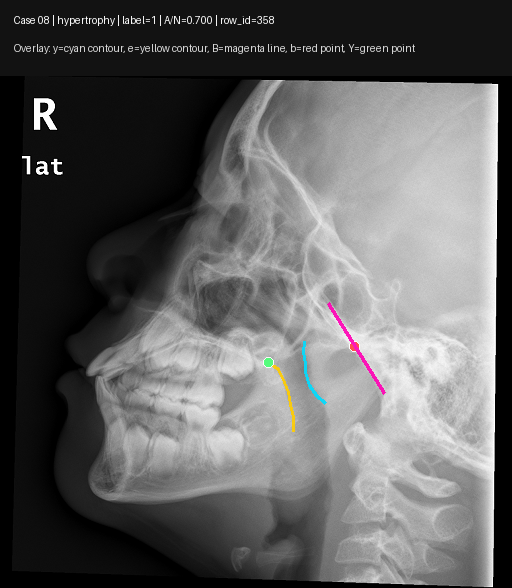
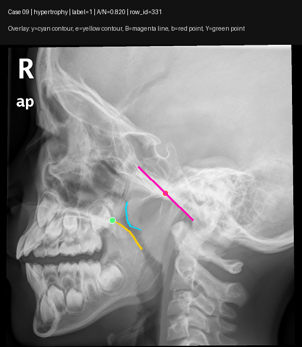
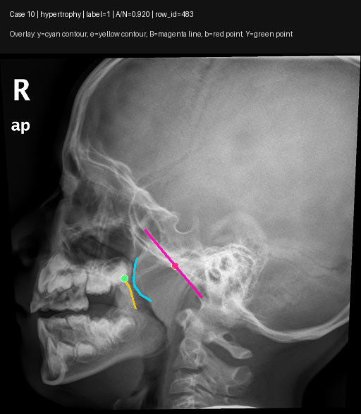

# ZYQ Dataset Description For Collaborators

Generated date: 2026-07-08

This note describes the ZYQ dataset as used in Experiment 002. It is intended for collaborators who need to understand what the data are, how the current matched subset was formed, what the labels and anatomical annotations mean, and how the example images should be interpreted.

## 1. Dataset Location

The dataset used by Experiment 002 is stored in:

```text
Dataset/ZYQ_Dataset
```

The main contents are:

| Item | Path | Description |
|---|---|---|
| Raw lateral X-ray images | `Dataset/ZYQ_Dataset/images/` | Original PNG images used as model input |
| LabelMe annotations | `Dataset/ZYQ_Dataset/labels/` | JSON files containing contours, points, and reference lines |
| Clinical spreadsheet | `Dataset/ZYQ_Dataset/腺样体肥大病例汇总表.xlsx` | Clinical metadata, including age, sex, A, N, A/N, PAS, and notes |
| Matching audit table | `Dataset/ZYQ_Dataset/excel_image_label_alias_match_audit.csv` | Image-label-spreadsheet matching audit |
| Matched sample JSON | `Dataset/ZYQ_Dataset/zyq_671_matched_samples.json` | 671 Excel-image-label matched records before the strict Experiment 002 contour filter |

## 2. Raw Dataset Summary

| Item | Count / value |
|---|---:|
| Raw PNG images in `images/` | 840 |
| LabelMe JSON files in `labels/` | 936 |
| Records in `zyq_671_matched_samples.json` | 671 |
| Image dimensions | 703 images are 512 x 512; 137 images are non-512 |
| Unique image dimensions | 133 |
| Width range | 512 to 3408 pixels |
| Height range | 512 to 3320 pixels |

The dataset contains lateral X-ray images with anatomical annotations related to adenoid hypertrophy assessment. Some images use legacy filenames, and some use DICOM-like identifiers. The matching audit table is used to link the spreadsheet records, image files, and JSON annotation files.

## 3. Experiment 002 Matched Subset

Experiment 002 does not use every raw file directly. The current experiments use a strict matched image-contour subset generated by `002002001_matched_image_only_baseline`.

Effective metadata file:

```text
experiments/002_image_contour_landmark_guided_fusion_classification/
  002002_image_contour_prediction/
    002002001_matched_image_only_baseline/
      outputs/metadata.csv
```

The filtering rules are:

| Step | Rule |
|---|---|
| 1 | The spreadsheet/audit row must have a valid normal or hypertrophy group. |
| 2 | The row must have at least one matched image and one matched JSON annotation. |
| 3 | The selected JSON file must contain both `y` and `e` linestrip contours. |
| 4 | The selected image file must exist in `Dataset/ZYQ_Dataset/images/`. |
| 5 | Duplicate `(sample_id, image_file)` pairs are removed. |

Final subset:

| Item | Count |
|---|---:|
| Matched image-contour rows | 667 |
| Unique sample IDs | 663 |
| Normal samples, label 0 | 324 |
| Hypertrophy samples, label 1 | 343 |
| Positive class in classification | Hypertrophy |

## 4. Clinical And Structural Fields

The clinical spreadsheet contains variables such as age, sex, A, N, A/N, PAS, imaging notes, surgery status, and comments. In the current paper-oriented Experiment 002 design, these clinical measurements are not used as direct test-time model inputs, because A/N and PAS are already close to the clinical decision definition.

Instead, the main fairness principle is:

```text
Training may use manual contours, landmarks, and reference lines as supervision.
Testing/inference uses only the raw X-ray image.
Manual contours, landmarks, A/N, and PAS are not directly fed into the model at test time.
```

A/N distribution in the 667 matched subset:

| Group | Count with A/N | Mean | Std | Min | Median | Max |
|---|---:|---:|---:|---:|---:|---:|
| All matched samples | 666 | 0.5796 | 0.1457 | 0.1700 | 0.6000 | 0.9600 |
| Normal | 323 | 0.4588 | 0.0957 | 0.1700 | 0.4710 | 0.6400 |
| Hypertrophy | 343 | 0.6934 | 0.0765 | 0.5500 | 0.6800 | 0.9600 |

## 5. LabelMe Annotation Schema

Each JSON annotation is a LabelMe-style file. Experiment 002 mainly uses the following labels:

| Label | Shape type | Meaning in Experiment 002 |
|---|---|---|
| `y` | `linestrip` | Primary adenoid-related contour used for contour supervision and fractal/shape analysis |
| `e` | `linestrip` | Reference anatomical contour used together with `y` |
| `b` | `point` | Landmark point for structure/geometry supervision |
| `Y` | `point` | Landmark point for structure/geometry supervision |
| `B` | `line` | Reference line segment for geometry/morphology supervision |

Structural annotation availability in the 667 matched subset:

| Annotation | Available rows |
|---|---:|
| `y` linestrip | 667 |
| `e` linestrip | 667 |
| `b` point | 666 |
| `Y` point | 659 |
| `B` line | 665 |

For contour-based models, the image is resized for network input, contour masks are rasterized at 224 x 224, and contour point representations are resampled to 128 points where the experiment requires point-sequence contour tokens.

## 6. Ten Example Cases

Ten cases were selected from the matched metadata for visual explanation: five normal and five hypertrophy examples. ASCII filenames were preferred so that links display cleanly on GitHub. Each selected case has `y`, `e`, `b`, `Y`, and `B` annotations.

Overlay legend:

| Visual element | Meaning |
|---|---|
| Cyan curve | `y` contour |
| Yellow curve | `e` contour |
| Magenta line | `B` reference line |
| Red point | `b` landmark |
| Green point | `Y` landmark |

Case manifest:

| Case | Group | Label | A/N | Row ID | Sample ID | Figure |
|---|---|---:|---:|---:|---|---|
| case_01 | normal | 0 | 0.303 | 2 | `15679228-0001-0001-0001-W27148L16426` | [image](case_examples/case_01_normal_row002_AN0.303.png) |
| case_02 | normal | 0 | 0.400 | 95 | `18260348-0001-0001-0001-W26376L16812` | [image](case_examples/case_02_normal_row095_AN0.400.png) |
| case_03 | normal | 0 | 0.480 | 23 | `16463939-0001-0001-0001-W27945L16027` | [image](case_examples/case_03_normal_row023_AN0.480.png) |
| case_04 | normal | 0 | 0.540 | 6 | `15738490-0001-0001-0001-W27223L16388` | [image](case_examples/case_04_normal_row006_AN0.540.png) |
| case_05 | normal | 0 | 0.620 | 19 | `16333983-0001-0001-0001-W26634L16683` | [image](case_examples/case_05_normal_row019_AN0.620.png) |
| case_06 | hypertrophy | 1 | 0.550 | 476 | `18268567-0001-0001-0001-W26555L16722` | [image](case_examples/case_06_hypertrophy_row476_AN0.550.png) |
| case_07 | hypertrophy | 1 | 0.640 | 329 | `15705749-0002-0001-0001-W26544L16728` | [image](case_examples/case_07_hypertrophy_row329_AN0.640.png) |
| case_08 | hypertrophy | 1 | 0.700 | 358 | `16408824-0001-0001-0001-W27694L16153` | [image](case_examples/case_08_hypertrophy_row358_AN0.700.png) |
| case_09 | hypertrophy | 1 | 0.820 | 331 | `15792543-0001-0001-0001-W27742L16129` | [image](case_examples/case_09_hypertrophy_row331_AN0.820.png) |
| case_10 | hypertrophy | 1 | 0.920 | 483 | `18277893-0001-0001-0001-W24600L17700` | [image](case_examples/case_10_hypertrophy_row483_AN0.920.png) |

## 7. Case Image Gallery





















## 8. Files In This Folder

| File/folder | Purpose |
|---|---|
| `ZYQ_DATASET_DESCRIPTION.md` | This dataset explanation note |
| `case_examples/` | Ten generated annotated case figures |
| `case_examples_manifest.csv` | CSV manifest for the ten cases |
| `generate_zyq_case_examples.py` | Reproducible script used to generate the case figures and manifest |

